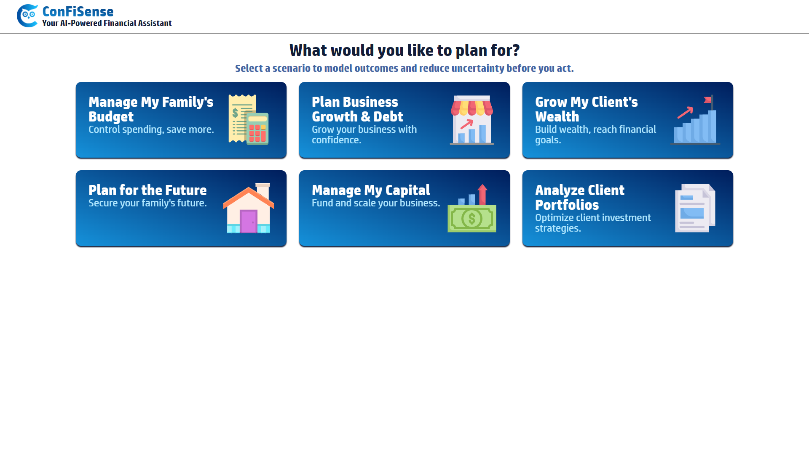

# ConFiSense

ConFiSense helps you make sense of complex financial data with ease, providing AI-powered insights, interactive dashboards, and seamless export features.

---

## ✨ Features

- 🏠 **Simple Home Page** – Clean landing screen for quick access.
- 📊 **Interactive Dashboard** – Input your data with an intuitive interface.
- 📈 **Smart Outputs** – Visual insights presented clearly.
- 🤖 **AI-Powered Explanations and Suggestions** – Understand your results with contextual insights.
- 📤 **Easy Export** – Download reports and share them effortlessly.

---

## 📸 Demo Screenshots

Here’s a quick look at **ConFiSense in action**:  

### 🏠 Home Page  
  

---

### 📊 Dashboard with Inputs  
  

---

### 📈 Dashboard with Outputs  
  

---

### 🤖 AI Explanation  
  

---

### 📤 Sample Export  
  

---

## 🚀 Quick Start

### 1. Navigate to Project Root

```bash
cd ConFiSense
```

---

### 2. Set Up Python Virtual Environment

```bash
python -m venv venv
```

Then activate it:

- **On Windows**:

    ```bash
    venv\Scripts\activate
    ```

- **On Mac/Linux**:

    ```bash
    source venv/bin/activate
    ```


---

### 3. Install Backend Dependencies

```bash
pip install -r requirements.txt
```

---

### 4. Run the Backend (FastAPI)

```bash
uvicorn app.main:app --reload
```

> Backend will run at:  
> `http://127.0.0.1:8000`

---

### 5. Run the Frontend (Tailwind + HTML + JS)

You have a few options for running the frontend.


#### Option A: The Simplest Way

Simply open the index.html file in your browser. The method is quick but may have issues with some browser security restrictions (like cross-origin requests).

1. Locate the file: `frontend/index.html`

2. Open it: Double-click the file or drag it into your browser's window.


#### Option B: Using a Python Simple Server

This is the recommended method for development as it provides a local server that handles API requests correctly.

1. Navigate to the frontend directory.

    ```bash
    cd frontend
    ```

3. Run a simple Python web server.

    ```bash
    python -m http.server 5500
    ```

    > The frontend will run at:  
    > `http://localhost:5500`


#### Option C: Using a Node.js Server

If you have Node.js and npm installed, this is another reliable way to run a local server.

1. Install the serve package globally.

    ```bash
    npm install -g serve
    ```

3. Navigate to the frontend directory.

    ```bash
    cd frontend
    ```

4. Run the server.

    ```bash
    serve .
    ```

    > The frontend will run at:  
    > `http://localhost:3000`
